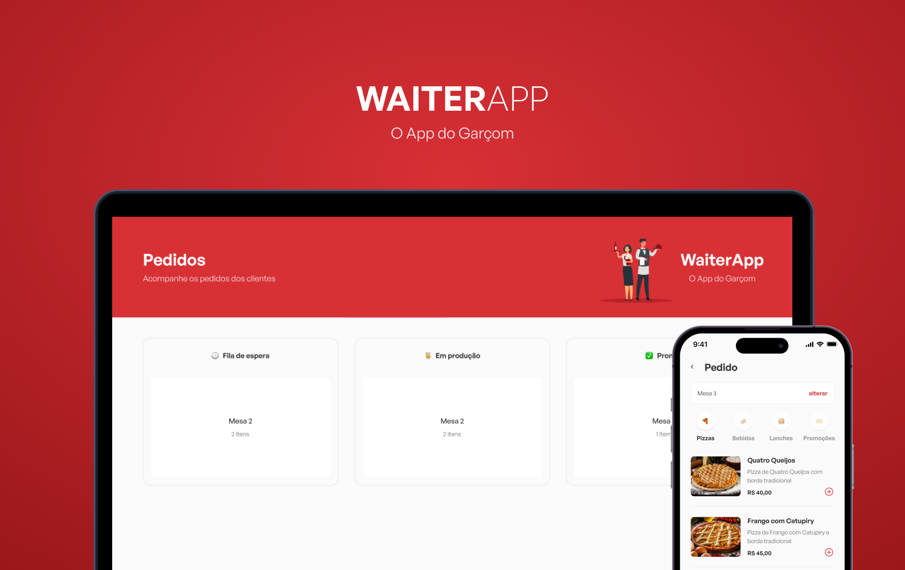

# WaiterApp - O App do garçom


<hr/>

## O que é?
<p align="center">
O WaiterApp foi um projeto desenvolvido durante a semana "O Poder do JavaScript", ministrado pelo Mateus Silva.
</p>
<hr/>


## Tecnologias utilizadas:
* Front-End

  * React
  * Styled-Components
  * Typescript(TSX)
  * Axios
  * Socket-io
  * React-Toastify
  
* Mobile

  * React-native
  * Expo
  * Styled-Components
  * Styled-Components/Native
  * Typescript(TSX)
  * Axios
  * Expo-font
  * React-native-svg
  
* BackEnd

  * NodeJS
  * Express
  * Socket-io
  * Multer
  * Dot env
  * Mongoose
  * Typescript
  
* Banco de dados

  * MongoDB
 <hr/>
 
# Como rodar o projeto?

> Como rodar a API?
```bash
# Como clonar
$ git clone https://github.com/samuelhuss/waiterapp.git
# Acesse a api
$ cd api
# Conecte ao banco de dados colocando a sua `CONNECTIONSTRING` no arquivo `.env`
mongodb+srv://<seu-usuario>:<sua-senha>@$<seu-cluster>.mongodb.net/?retryWrites=true&w=majority # caso for usar atlas mongoose
mongodb://localhost:27017 # usando docker
# Rode a api(acesse http://localhost:3001/).
# Instale as dependências da api
$ npm i
$ npm run build
$ npm run start
```

>Como rodar o front-end?
```bash
# Com o projeto ja clonado
# Acesse a pasta do front-end
$ cd fe
# Instale as dependências do front-end
$ npm i
# Rode o projeto(acesse http://localhost:5173/).
$ npm run dev
```
>Como rodar o mobile?
```bash
# Com o projeto ja clonado
# Acesse a pasta do app mobile
$ cd app
# Instale as dependências do mobile
$ npm i
# Rode o projeto.
$ npm run start
```

